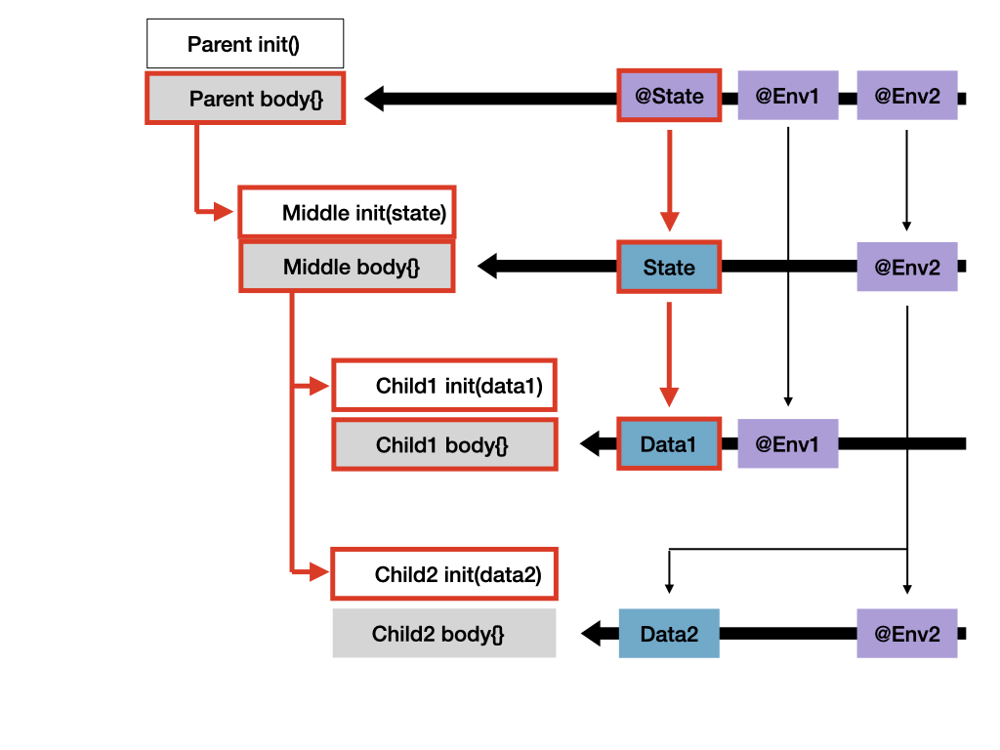
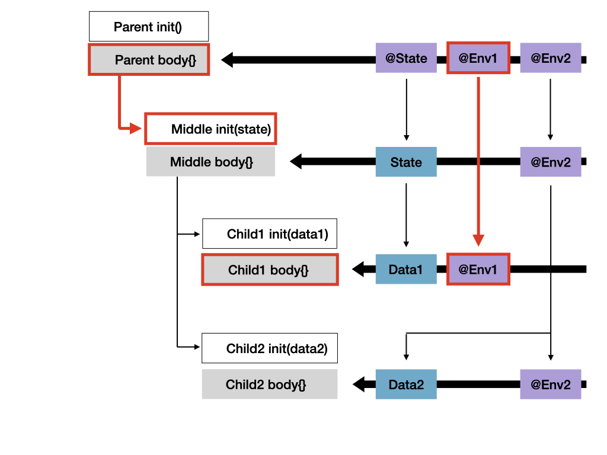

# SwiftUI experiments with init(), body{}, dependencies, identity and lifetime

After watching the [WWDC 2021 Demystify SwiftUI session video](https://developer.apple.com/videos/play/wwdc2021/10022), I wanted to play with the concept to get a better understanding.

This is a simple SwiftUI Xcode macOS project to demonstrate how these work.

## Run

Download, build and run on a macOS target, play around and inspect the output.

## A bit of theory

Unlike in UIKit and AppKit, which are *imperative* UI frameworks, where we explicitly create, update and destroy views on screen, in SwiftUI, which is a *declarative* UI framework, we produce a description of what we want our UI to look like, and SwiftUI takes care of creating, updating and managing the views on screen.

In SwiftUI we describe our interface with values that conform to the `View` protocol. Keyword here is **values**. Not references. These values, that we call "view values" describe a result that we want, they have no concept of identity, and get recreated everytime we want to update part of the UI.

We create the view values in the `View.body` property. Creating a view value uses `View.init()`, but it is important to remember that this `init()` does not create a view per say, only a view value. During the lifetime of a program many copies of a view value can be created for the same on-screen view.

Under the hood, SwiftUI maps view values with on-screen view, mostly based on their position on the view hierarchy, but we can help it by providing explicit identifiers.

An on-screen view gets updated when one of the following happens: the view gets a different view value, or at least one of the dependencies of the view change. View dependencies are `@State`, `@Binding` and `@Environement`. They are not part of the view value but they can take part in the `body`.

When it is time to update a view, SwiftUI calls the `View.body`, and ensures it has access to the latest view value and dependencies. If the body produces view values that are identical to the previous ones, no further update is required. Otherwise, bodies of the child views get called, and so forth.

With this system, only the views that actually change are updated. Even if their parent view changes, as long as it produces the same view value for it's children, they do not need to update.

And in case you are wondering, if say an environment value changes, but also makes a parent view change the same view value, the view's `body` only runs once and sees both changes.

## Demo: init(), body(), updates and dependencies


In this first example we have four views: a root view, a middle view, and two child views. The root view has a state and two state objects that get passed down the tree in the environment. The state gets passed as prop to the middleview, which in turn passes it to the first child view. The middle view reads the second environment object. The children read the first and second environment values respectively. The middle view passes the env object's value as data to the second child view.


All `init()` and `body` have a `print` call to log when they execute. `body` also have a call to `_printChanges()` which prints the changes that justify that `body` be run again. I reformatted a bit the outputs below for better clarity.

When we first start the program, nothing exists, so every `init()` and every `body` is run. From SwiftUI's perspective, it is like everything has changed. Note that in the case of our sibling views, all the `init()` are run before any of the `body`.

    ParentView init
    ParentView body: @self, @identity, _env1, _env2, _state changed.
    MiddleView init
    MiddleView body: @self, @identity, _env2 changed.
    ChildView1 init
    ChildView2 init
    ChildView1 body: @self, @identity, _env1 changed.
    ChildView2 body: @self, @identity, _env2 changed.

`@self changed` means the view value changed. Usually because a struct property changed.

When we increment the state by clicking the first button, the parent `body` is recomputed. It recreates the view value for the middleview, which needs to re-render since the `state` property changed. It in turn recreates view values for the child views, but only the first one needs to re-render since the second one has not changed.

    ParentView body: _state changed.
    MiddleView init
    MiddleView body: @self changed.
    ChildView1 init
    ChildView2 init
    ChildView1 body: @self changed.



When we increment the first environment value by clicking the second button, the view value for the middleview is again recreated by the parent's `body`, but this time it does not need to re-render because every data it depends on is unchanged. Only the first child view re-runs its `body` since it depends on the changed environment value. The view value for the first child view is still the same as before.

    ParentView body: _env1 changed.
    MiddleView init
    ChildView1 body: _env1 changed.



When we increment the second environment value by clicking the third button, note that both changes appear in one single update.

    ParentView body: _env2 changed.
    MiddleView init
    MiddleView body: _env2 changed.
    ChildView1 init
    ChildView2 init
    ChildView2 body: @self, _env2 changed.


## Demo: identity and lifetime


In this example we have one view with two states: `red` that we can toggle on or off, and `id` that we can increment. Below we have two sibling views, each one with a state counter that we can increment.

The first section conditionnally applies a `.foregroundColor()` view modifier using an `if/else` statement, while the second section uses a ternary condition as the modifier's value. The first section passes the same explicit stable id in both branches, while the second section uses the `id` state.

```swift
// first
if red {
    ContentView1()
        .id("stableid1")
        .foregroundColor(.red)
} else {
    ContentView1()
        .id("stableid1")
}

// second
ContentView2()
    .id(id)
    .foregroundColor(red ? .red : .primary)
```

In the first section, because of the `if/else`, SwiftUI creates and destroys a new view each time we toggle the state, even if both branch produce the same view value. Passing an explicit stable id does not seem to help. SwiftUI doesn't consider the two view values to refer to the same on-screen view.

Creating a new on-screen view causes `ContentView.body` to be re-run each time, which in real world situations could be an expensive operation. Also the state is reset.

In the second section, SwiftUI always map the view value to the same on-screen view, and `ContentView.body` does not even need to run when we toggle the state since the view value does not change, and the sate is preserved.

However when we increment the `id` state, the identity of the second view changes. This means SwiftUI considers that this refers to a new on-screen view, and the old one should be discarded. `ContentView.body` is re-run to create the new view, and the state is reset.